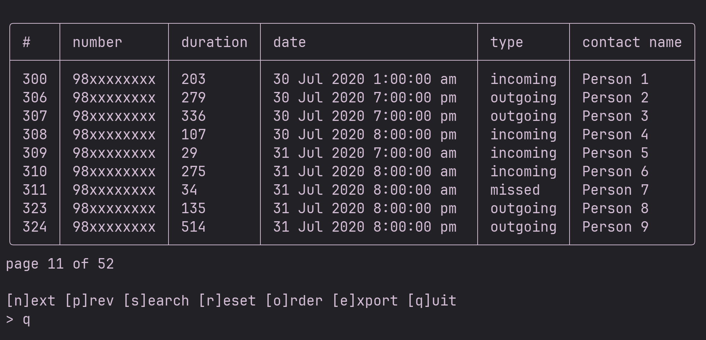

## Call History Viewer

A simple text based TUI to view call history. Basically takes it in XML
export of call logs of a specific format and shows the information in
respective UI.

#### Usage

Just run `./build/app`. it will ask for the path to the XML file and after
that you will be presented with a TUI similar to below.

